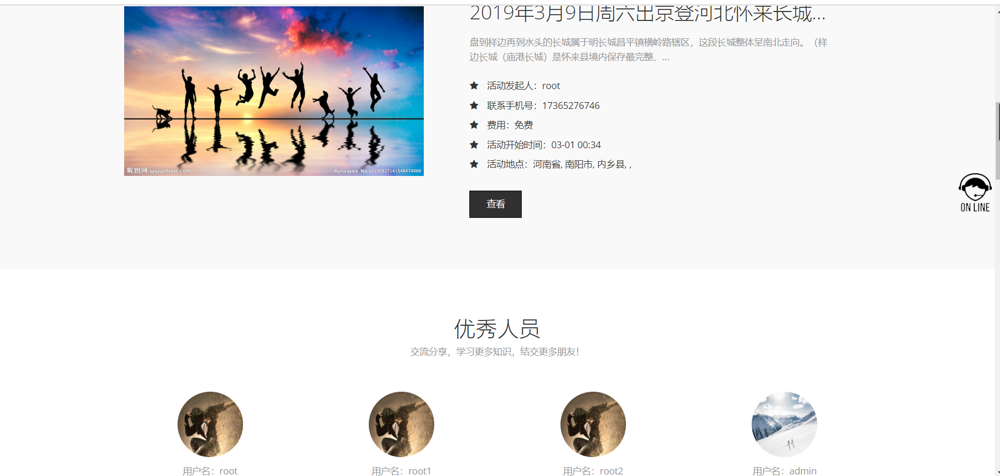
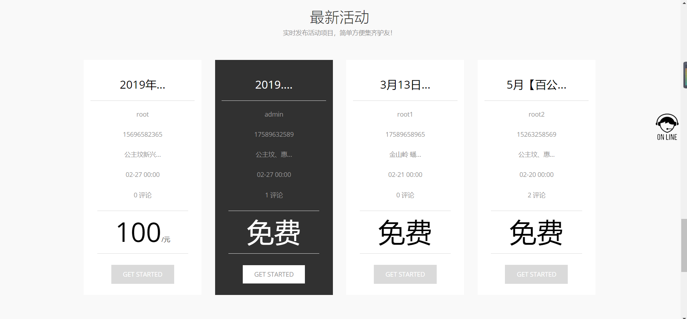
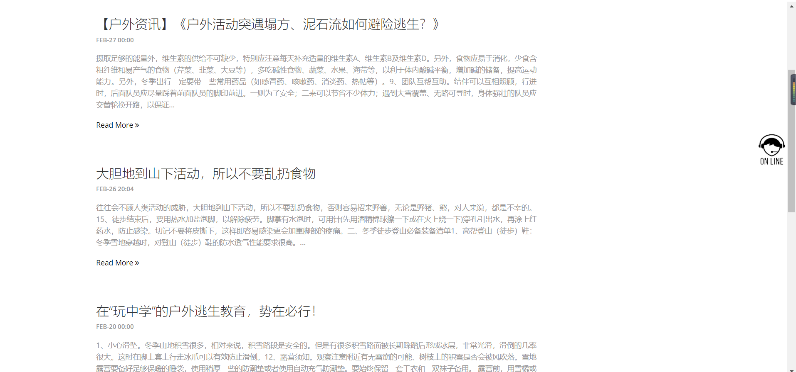
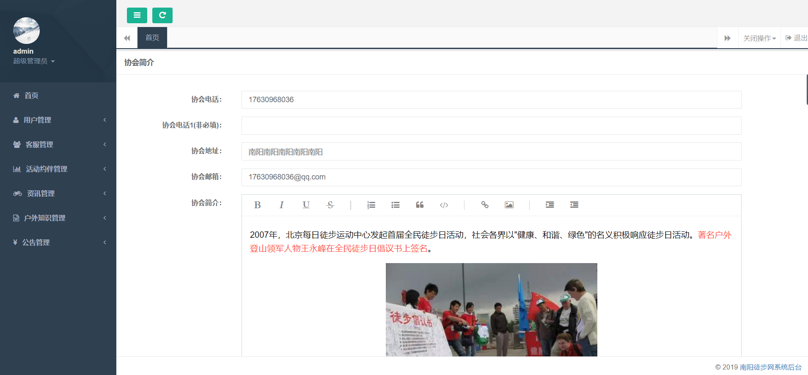

# 徒步网论坛
### 南阳徒步网 -- 网站  （ 7 天 1 人）

初始化项目

```
git init
```

设置项目仓库地址

```
git remote add origin git@github.com:songchuanwei/walk.git
```

拉取项目

```
git pull origin master
```

导入数据库 walk.sql

修改application/database.php   数据库相关信息












